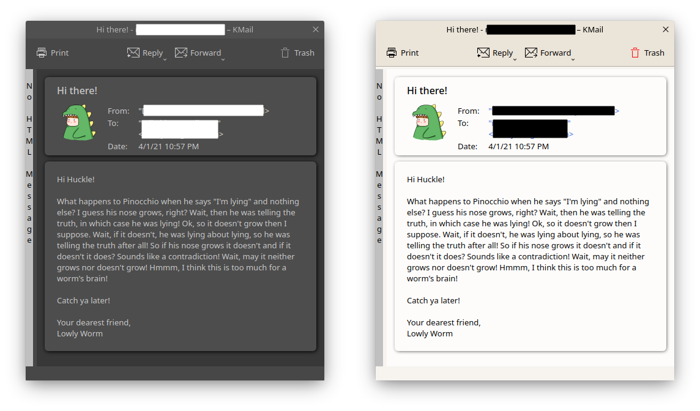
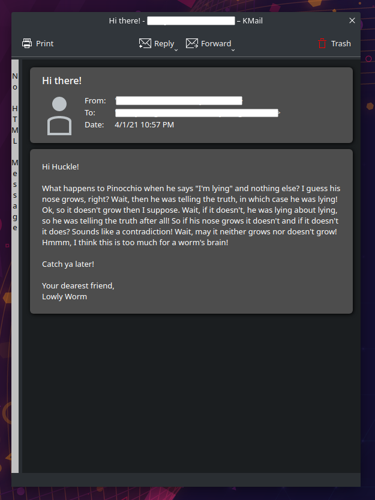

# Borders: A KMail header theme

This header theme is a mild variation of the default theme "KMail 5.2". It better separates the header and body of the message and looks nicer to my eye. There's a light version and a dark version.

Changes:
- Header and body given borders with 6px radius and shadows
- Subject title font size reduced and given a weight of 500 (from normal = 400)
- Date font weight reduced to normal (from bold) and made black for better contrast
- No hardcoded colors
- Minimum padding so that screen space isn't wasted

To install, copy the folder "borders" or "boders-dark" to ~/.local/share/messageviewer/themes/, restart KMail, and select the header theme "Borders" or "Borders Dark".
