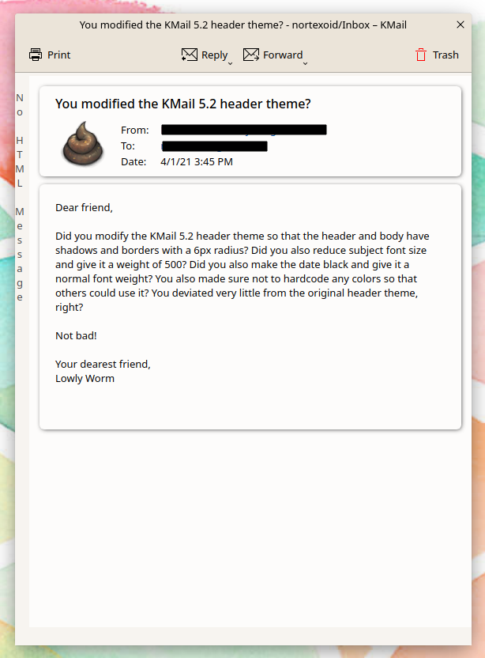
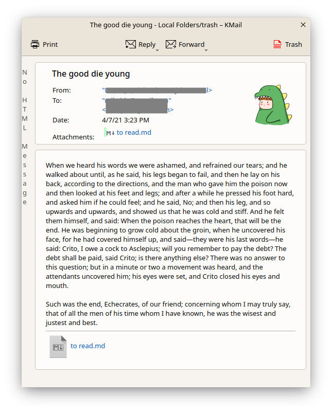

# Borders: A KMail header theme

(The flat theme screenshot shows a slightly modded version of Borders Flat to fit my own color scheme.)

This header theme is a mild variation of the default theme "KMail 5.2". It better separates the header and body of the message and looks nicer to my eye. There's a light and dark version, plus flat versions of these (not pictured).

Changes:
- Header and body given borders with 6px radius and shadows (no shadow for the flat version)
- Subject title font size reduced and given a weight of 500 (from normal = 400)
- Date font weight reduced to normal (from bold) and made black for better contrast
- No hardcoded colors (for the light theme--dark uses hardcoded gray background color)
- Minimum padding so that screen space isn't wasted

To install, copy the folder "borders" (or one of its variants) to ~/.local/share/messageviewer/themes/, restart KMail, and select the header theme "Borders" (or one of its variants).
